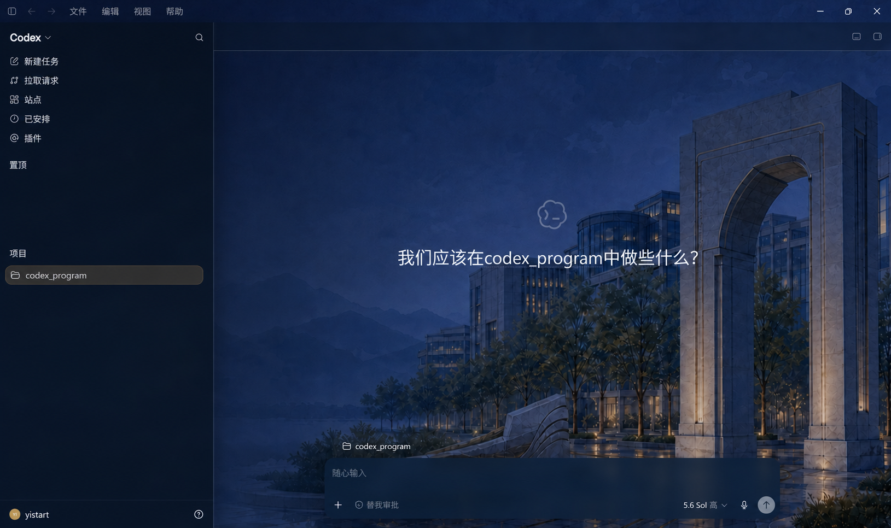
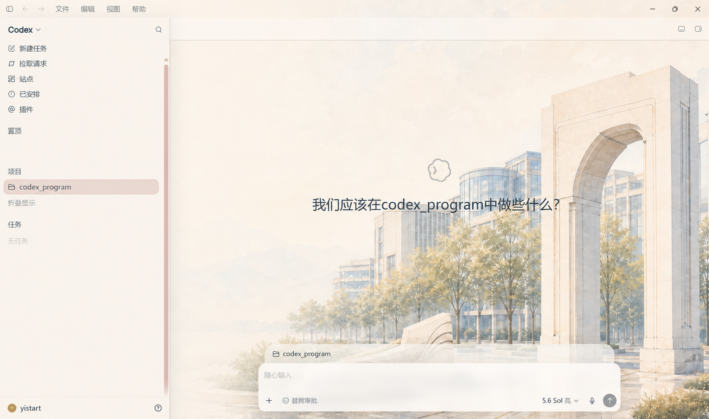
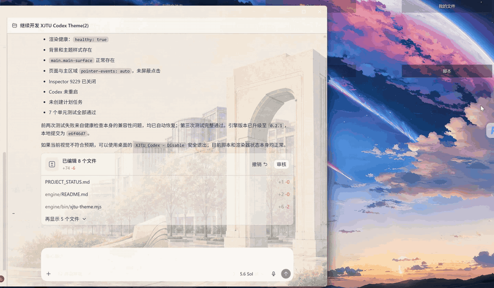

# XJTU Codex Theme

一个面向 Microsoft Store 版 Codex Desktop 的 Windows 本地主题项目。它包含三部分：

1. **XJTU Academic Theme**：已经配好的西安交通大学校园浅色/暗色主题，可直接试用。
2. **Codex Skin Maker**：面向普通用户的一句话换肤 Skill，提供图片后自动生成、检查、预览和恢复。
3. **Unbranded Template**：无品牌主题模板，供开发者和高级用户制作自己的主题。

主题通过短暂的本机 Node Inspector 脉冲注入到正在运行的 Codex，不修改 `WindowsApps`、`app.asar`、Codex 配置、浏览器资料或登录凭据。应用、切换和退出主题都不要求重启 Codex。

> [!WARNING]
> 这是非官方实验性项目，不隶属于 OpenAI 或西安交通大学。它依赖 Codex Desktop 的 Electron 内部结构，Codex 更新后可能需要适配。维护者当前单机验证的最新 Codex Desktop 版本为 `26.721.3996.0`；精确环境与验收范围见兼容矩阵。

精确兼容状态、Codex 更新后的检查步骤和反馈要求见 [`docs/COMPATIBILITY.md`](docs/COMPATIBILITY.md)。

## 效果预览

| XJTU Academic Dark | XJTU Academic Light |
| --- | --- |
|  |  |

### 无重启切换演示



[观看无音轨高清 MP4 演示](https://github.com/jiezeng2004-design/XJTU-Codex-Theme/releases/latest/download/xjtu-codex-theme-demo.mp4)

## XJTU 成品主题

环境要求：

- Windows 10/11 x64
- Microsoft Store 版 Codex Desktop
- Node.js 22 或更新版本

先运行只读检查：

```cmd
xjtu-theme.cmd doctor
```

无重启加载主题：

```cmd
xjtu-theme.cmd preview dark
xjtu-theme.cmd preview light
```

切换、验证和退出：

```cmd
xjtu-theme.cmd switch
xjtu-theme.cmd verify
xjtu-theme.cmd disable
```

创建桌面快捷方式：

```powershell
powershell -ExecutionPolicy Bypass -File .\scripts\install-desktop-shortcuts.ps1
```

`preview` 仅作用于当前 Codex 进程。`disable` 会移除注入的样式与事件钩子，并清理本地主题状态。默认不会创建计划任务。

## 一句话换肤 Skill

[`codex-skin-maker`](skills/codex-skin-maker/SKILL.md) 面向不熟悉 Git、Node.js、主题 JSON 或 Inspector 的普通用户。用户提供一张或两张自己拥有使用权的图片后，Skill 会：

1. 检查 Windows、Node.js、Microsoft Store Codex、固定来源工作区和版本兼容性；
2. 从无品牌模板生成浅色和深色皮肤；
3. 运行主题校验、资源检查、单元测试、安全测试和离线 Dry Run；
4. 展示简明结果并等待用户明确确认；
5. 只预览一个模式，随后执行 `verify`；
6. 失败时立即执行 `disable` 恢复原版。

可以让 Codex 安装 GitHub 中的 Skill：

```text
使用 $skill-installer 安装这个 Skill：
https://github.com/jiezeng2004-design/XJTU-Codex-Theme/tree/main/skills/codex-skin-maker
```

安装后提供图片并说：

```text
使用 $codex-skin-maker，把这张图片做成我的 Codex 皮肤。
浅色和深色都要，先生成和检查，不要直接应用。
```

完整的普通用户教程见 [`docs/CODEX_SKIN_MAKER.md`](docs/CODEX_SKIN_MAKER.md)。

自动引导默认从官方仓库的已验证 `v0.3.0-rc.3` 提交准备工作区，不跟随可变分支，也不接受自定义远程源。

## 使用自己的图片

无品牌模板位于 [`template/unbranded/`](template/unbranded/)。高级主题制作流程见：

- [`docs/CREATE_CUSTOM_THEME_WITH_CODEX.md`](docs/CREATE_CUSTOM_THEME_WITH_CODEX.md)
- 普通用户 Skill：[`skills/codex-skin-maker/SKILL.md`](skills/codex-skin-maker/SKILL.md)
- 高级主题作者 Skill：[`skills/codex-theme-author/SKILL.md`](skills/codex-theme-author/SKILL.md)

需要精细调整 manifest、布局和主题源时，可以对 Codex 说：

```text
使用这个仓库的 $codex-theme-author，根据我提供的图片制作浅色和暗色 Codex 主题。
保留无重启注入、verify、disable 和失败恢复机制。
先只生成主题并运行测试和 DryRun，不要实际应用，等我确认后再 preview。
```

推荐图片：2560×1440、16:9、JPEG/PNG/WebP。为了给侧栏和输入区留出可读空间，建议主体位于画面右侧，左侧保持低信息区域。如果只提供一张图，Codex 可以复用图像并为浅色/暗色配置不同颜色与遮罩；也可以分别提供两张图片。

## 安全边界

- Inspector 只绑定 `127.0.0.1:9229`，每次注入后立即关闭。
- 连接后必须验证目标 PID 是当前 Store Codex 主进程。
- 已存在的旧 CodeDrobe 事务或端口 9335 会阻止热引擎运行。
- `verify` 检查主题样式、背景、主区域与指针事件。
- `disable` 可以在残留 Inspector 确认属于同一 Codex PID 后接管并恢复。
- 不读取或复制 Cookie、登录态、API Key 或 Codex 对话内容。
- `codex-skin-maker` 不会把最初的制作请求视为真实注入授权；预览前必须再次明确确认。

## 项目结构

```text
assets/backgrounds/         XJTU 原始背景素材
themes/xjtu-academic-*/     XJTU CodeDrobe 兼容主题源
engine/                     无重启主题引擎
template/unbranded/         无品牌派生模板
skills/codex-skin-maker/    普通用户一键换肤 Skill
skills/codex-theme-author/  高级 Codex 主题作者 Skill
docs/                       自定义主题与兼容性教程
scripts/                    安装、验证与恢复脚本
```

`dist/` 和旧 CodeDrobe 脚本作为历史兼容与恢复资料保留。新的默认入口是 `xjtu-theme.cmd`。

## 许可

本项目采用 [`XJTU Codex Theme Non-Commercial Source License 1.0`](LICENSE)：

- 个人、学习、研究和其他非商业用途可以查看、使用、修改和再分发。
- 商业使用、收费服务、商业产品集成或以商业利益为目的的使用，需要事先联系项目作者并取得单独商业授权。
- 该许可不是 OSI 批准的开源许可证，因此本项目应准确描述为 **source-available / 源代码公开项目**。

商业授权方式见 [`COMMERCIAL_LICENSE.md`](COMMERCIAL_LICENSE.md)。第三方许可见 [`engine/THIRD_PARTY_NOTICES.md`](engine/THIRD_PARTY_NOTICES.md)。

作者：`yistart`。商业授权联系邮箱：`jiezeng2004@gmail.com`。

## 致谢与声明

Inspector 脉冲架构参考了 `okkskin` 0.2.0 的 MIT 授权实现，相关版权和许可全文已保留。本项目及其中的 XJTU 风格素材为非官方创作，不代表 OpenAI 或西安交通大学的认可、授权或官方发布。
